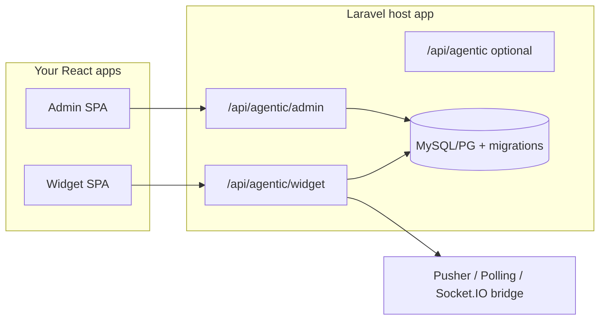

# Agentic frontend implementation guide

**Purpose:** Single source of truth for building **two separate React apps** (Admin dashboard + embeddable Chat widget) against the Agentic Laravel package APIs.  
**Last updated:** 2026-09-27 (keep this file in sync when routes or events change in `routes/*.php`).

**Related files**

| File | Use |
|------|-----|
| [`COPY_PROMPT_FOR_AI.md`](./COPY_PROMPT_FOR_AI.md) | Paste into Cursor/Claude to implement UI |
| [`../.env.example`](../.env.example) | Laravel backend env |
| [`SYSTEM_DESIGN.md`](./SYSTEM_DESIGN.md) | Architecture diagrams and flows |

---

## 1. System overview

The **package does not ship production UI**. You implement:

1. **Admin SPA** → `AGENTIC_ADMIN_API_PREFIX` (default `/api/agentic/admin`)
2. **Widget SPA** (embeddable) → `AGENTIC_WIDGET_PREFIX` (default `/api/agentic/widget`)

Optional third client: **Runtime API** → `AGENTIC_API_PREFIX` (default `/api/agentic`, off by default).



**Auth:** The package ships **Laravel Sanctum** + **WebAuthn passkeys** (`laravel/passkeys`) under `AGENTIC_AUTH_PREFIX` (default `/api/agentic/auth`). Enable `AGENTIC_ADMIN_REQUIRE_AUTH=true` to guard the admin API with `auth:sanctum`. Widget routes use Sanctum stateful middleware when `AGENTIC_AUTH_STATEFUL_WIDGET=true` so logged-in users share the passkey session. Guest widget traffic still uses `X-Agentic-Guest-Id` (see below).

**Host app setup**

1. `composer require laravel/sanctum laravel/passkeys`
2. Publish migrations: `php artisan vendor:publish --tag=sanctum-migrations` and `--tag=passkeys-migrations`, then `migrate`
3. User model: `HasApiTokens`, `PasskeyAuthenticatable`, implements `PasskeyUser`
4. Sanctum SPA: configure `SANCTUM_STATEFUL_DOMAINS` and CORS; call `GET /sanctum/csrf-cookie` before passkey login from your React apps
5. Optional: `npm install @laravel/passkeys` in admin SPA for `Passkeys.verify()` / `Passkeys.register()`

**Auth API routes** (prefix `/api/agentic/auth`)

| Method | Path | Auth | Purpose |
|--------|------|------|---------|
| GET | `/passkeys/login/options` | guest | WebAuthn assertion options |
| POST | `/passkeys/login` | guest | Verify passkey; JSON includes `user` + optional `token` |
| GET | `/me` | sanctum | Current user |
| POST | `/token` | sanctum | Issue Bearer personal access token |
| POST | `/logout` | sanctum | Revoke token + end session |
| GET | `/passkeys/register/options` | sanctum | Register new passkey |
| POST | `/passkeys/register` | sanctum | Store passkey |
| DELETE | `/passkeys/{id}` | sanctum | Remove passkey |

---

## 2. Frontend environment (Vite example)

Create `.env` in each React project:

```env
# Admin app
VITE_API_BASE_URL=https://your-app.test
VITE_AGENTIC_ADMIN_PREFIX=/api/agentic/admin

# Widget app
VITE_API_BASE_URL=https://your-app.test
VITE_AGENTIC_WIDGET_PREFIX=/api/agentic/widget
VITE_DEFAULT_AGENT=support
```

Helper:

```ts
export const adminUrl = (path: string) =>
  `${import.meta.env.VITE_API_BASE_URL}${import.meta.env.VITE_AGENTIC_ADMIN_PREFIX}${path}`;

export const widgetUrl = (path: string) =>
  `${import.meta.env.VITE_API_BASE_URL}${import.meta.env.VITE_AGENTIC_WIDGET_PREFIX}${path}`;
```

---

## 3. Shared HTTP conventions

### 3.1 Locale (Admin + Widget config)

| Mechanism | Priority (high → low) |
|-----------|------------------------|
| Query | `?locale=en` or `?locale=ar` |
| Header | `X-Agentic-Locale: ar` |
| Session | `agentic.admin.locale` (admin web only) |
| Accept-Language | Browser default |
| Fallback | `AGENTIC_ADMIN_LOCALE` / widget locale config |

**RTL:** Read `meta.direction` (`ltr` \| `rtl`), `meta.is_rtl`, `meta.html_lang` from admin dashboard/translations or widget config meta.

### 3.2 Admin list pagination & filters

All admin **index** endpoints return:

```json
{
  "data": [ /* resources */ ],
  "meta": {
    "locale": "en",
    "direction": "ltr",
    "html_lang": "en",
    "is_rtl": false,
    "supported_locales": ["en", "ar"],
    "total": 42,
    "page": 1,
    "per_page": 25,
    "last_page": 2
  }
}
```

| Query param | Description |
|-------------|-------------|
| `page` | Page number (default 1) |
| `per_page` | 1–100 (default 25) |
| `q` | Case-insensitive search substring |
| `status` | Filter by status field where applicable |
| `agent` | Filter executions/conversations by agent slug |
| `fetch_limit` | Executions/conversations: max rows loaded before filter (default 200, max 500) |

### 3.3 Standard JSON shapes

- **Resource:** `{ "data": { ... } }`
- **Collection (non-paginated):** `{ "data": [ ... ] }`
- **Delete success:** `204` empty body
- **Error:** `{ "message": "..." }` with 4xx/5xx

### 3.4 Widget identity headers

| Header | When | Purpose |
|--------|------|---------|
| `X-Agentic-Guest-Id` | Guest users | Stable guest id (persist in localStorage); server may generate UUID if missing |
| `X-Agentic-Tenant-Id` | Optional | Passed through to conversations (host-defined) |
| Laravel auth cookie / Bearer | Authenticated widget | When `AGENTIC_WIDGET_AUTH_MODE=auth` or `both` |

**403** if auth mode disallows current user type (`EnsureWidgetAccess` middleware).

---

## 4. Admin API — full route reference

**Base:** `{APP_URL}/{AGENTIC_ADMIN_API_PREFIX}` → default `/api/agentic/admin`  
**Middleware:** `api`, `SetAdminLocale`  
**Enabled when:** `AGENTIC_ADMIN_ENABLED=true` and `AGENTIC_ADMIN_API_ENABLED=true`

### 4.1 Dashboard & i18n

| Method | Path | Description |
|--------|------|-------------|
| `GET` | `/dashboard` | Stats + locale meta |
| `GET` | `/translations` | Full `agentic::admin` translation tree + meta |
| `GET` | `/locale` | Current locale meta |
| `PUT` | `/locale` | Body: `{ "locale": "ar" }` |

**Dashboard response:**

```json
{
  "data": {
    "stats": {
      "agents": 0,
      "skills": 0,
      "tools": 0,
      "knowledge_sources": 0,
      "executions": 0,
      "conversations": 0
    }
  },
  "meta": { "locale": "en", "direction": "ltr", "is_rtl": false, "supported_locales": ["en", "ar"], "html_lang": "en" }
}
```

### 4.2 Agents

| Method | Path | Body / notes |
|--------|------|----------------|
| `GET` | `/agents` | Paginated list |
| `POST` | `/agents` | Create (see Agent fields below) |
| `GET` | `/agents/{slug}` | Single |
| `PUT` | `/agents/{slug}` | Update |
| `DELETE` | `/agents/{slug}` | Delete |
| `POST` | `/agents/{slug}/execute` | `{ "message": "...", "conversation_id?": "", "metadata?": {}, "variables?": {} }` → `{ "data": <runtime output> }` |

**Agent resource fields:** `id`, `name`, `slug`, `description`, `instructions`, `status` (`draft` \| `published` \| `archived`), `provider`, `model`, `temperature`, `max_tokens`, `skills[]`, `tools[]`, `knowledge[]`, `permissions[]`, `runtime`, `config`.

### 4.3 Skills, tools, knowledge

Same CRUD pattern as agents:

- `/skills`, `/skills/{slug}`
- `/tools`, `/tools/{slug}`
- `/knowledge-sources`, `/knowledge-sources/{slug}`

**Extra knowledge routes:**

| Method | Path | Body |
|--------|------|------|
| `POST` | `/knowledge-sources/{slug}/index` | Re-index documents |
| `POST` | `/knowledge-sources/{slug}/search` | `{ "query": "...", "limit?": 5 }` → `{ "data": [ { "content", "source?", "score?", "metadata?" } ] }` |

### 4.4 Widget settings (DB per agent)

| Method | Path | Description |
|--------|------|-------------|
| `GET` | `/widget-settings/schema` | JSON schema for form generation |
| `GET` | `/widget-settings` | Paginated list |
| `GET` | `/widget-settings/{agentSlug}` | Merged settings for one agent |
| `PUT` | `/widget-settings/{agentSlug}` | Upsert (partial merge server-side) |
| `DELETE` | `/widget-settings/{agentSlug}` | Remove overrides |

**PUT body:**

```json
{
  "settings": {
    "auth_mode": "both",
    "locale": "ar",
    "agent_language": "ar",
    "intake_enabled": true,
    "welcome_message": "Welcome",
    "intake_questions": ["Order id?"],
    "theme": {
      "default": "dark",
      "direction": "auto",
      "custom": { "primary": "#0055ff" },
      "sounds": { "send": "/sounds/send.mp3" }
    },
    "reply_formats": ["text", "blocks", "actions"]
  }
}
```

### 4.5 Executions & conversations (read-only)

| Method | Path |
|--------|------|
| `GET` | `/executions`, `/executions/{id}` |
| `GET` | `/conversations`, `/conversations/{id}` |

---

## 5. Widget API — full route reference

**Base:** `{APP_URL}/{AGENTIC_WIDGET_PREFIX}` → default `/api/agentic/widget`  
**Middleware:** `api`, `SetAdminLocale`, `EnsureWidgetAccess`  
**Enabled when:** `AGENTIC_WIDGET_ENABLED=true`

### 5.1 Config

| Method | Path | Query |
|--------|------|-------|
| `GET` | `/config` | `?agent={slug}` recommended |

**Response `data` highlights:**

- `auth`, `conversation`, `intake`, `locale`, `theme`, `reply`, `realtime`, `providers`
- `realtime.driver`: `pusher` \| `polling` \| `socketio` \| `null`
- `reply.render`: `blocks` (prefer rendering `blocks` over raw HTML when present)

### 5.2 Conversations

| Method | Path | Body / query |
|--------|------|----------------|
| `GET` | `/conversations` | Query: `agent` (required) |
| `POST` | `/conversations` | `{ "agent", "locale?", "metadata?" }` → 201 |
| `GET` | `/conversations/{id}/messages` | Message history (no `system` role messages) |
| `POST` | `/conversations/{id}/messages` | `{ "agent", "message", "locale?", "metadata?" }` |
| `POST` | `/messages` | Same as above + optional `conversation_id` (create or continue) |

**Send message success `data`:**

```json
{
  "success": true,
  "conversation_id": "uuid",
  "message": {
    "id": "uuid",
    "role": "assistant",
    "html": "<p>...</p>",
    "format": "blocks",
    "blocks": [ /* see §7 */ ],
    "tokens_in": 0,
    "tokens_out": 0,
    "tokens_total": 0,
    "locale": "en",
    "created_at": "ISO8601"
  },
  "usage": { "tokens_in": 0, "tokens_out": 0, "tokens_total": 0 }
}
```

**Failure:** `{ "data": { "success": false, "error": "...", "conversation_id": "..." } }` with HTTP 422.

### 5.3 Tool approvals

| Method | Path | Notes |
|--------|------|-------|
| `POST` | `/approvals/{uuid}/approve` | May include `data.execution` (tool run + optional `resume`) |
| `POST` | `/approvals/{uuid}/reject` | |
| `POST` | `/approvals/{uuid}/execute` | Run already-approved tool |

**Approve response when auto-execute + auto-resume enabled:**

```json
{
  "data": {
    "id": "approval-uuid",
    "status": "approved",
    "tool": "orders.write",
    "arguments": { },
    "execution": {
      "success": true,
      "approval_id": "...",
      "tool": "orders.write",
      "result": { },
      "error": null,
      "resume": {
        "success": true,
        "conversation_id": "...",
        "message": { /* new assistant message */ }
      }
    }
  }
}
```

**Detect pending approval from assistant/tool errors:** LLM tool failure JSON may contain:

```json
{ "code": "pending_approval", "approval_id": "uuid", "tool": "orders.write" }
```

Parse tool error strings in the UI and show an approval card with Approve/Reject actions.

### 5.4 Realtime polling

| Method | Path | Query |
|--------|------|-------|
| `GET` | `/conversations/{conversationId}/realtime` | `since_id=0`, `limit=50` |

Only when backend `AGENTIC_WIDGET_BROADCAST_DRIVER=polling`.

**Response:**

```json
{
  "data": [
    { "id": 1, "event": "message.created", "payload": { }, "created_at": "ISO8601" }
  ],
  "meta": { "channel": "agentic-widget.{conversationId}", "since_id": 0 }
}
```

Advance `since_id` to the highest event `id` after each poll. Interval: `data.realtime.polling.interval_ms` from config.

---

## 6. Realtime events catalog

**Channel name:** `{channel_prefix}.{conversationId}`  
Default prefix: `agentic-widget` → `agentic-widget.550e8400-e29b-41d4-a716-446655440000`

| Event name | When | Payload (typical) |
|------------|------|-------------------|
| `message.created` | New assistant reply after user message | `{ success, conversation_id, message, usage }` |
| `message.resumed` | New assistant reply after tool approval auto-resume | Same shape as `message.created` |
| `tool.approval.executed` | Approved tool finished running | `{ success, approval_id, tool, result, error }` |

### Driver implementation notes (frontend)

| Driver | Frontend action |
|--------|-------------------|
| `pusher` | Subscribe with `pusher-js` to channel above; bind all event names |
| `polling` | Loop `GET .../realtime?since_id=` |
| `socketio` | Connect to **your** relay; server receives POST from Laravel at `AGENTIC_WIDGET_SOCKETIO_URL` — mirror same channel/event names |
| `null` | Poll message history or rely on HTTP response only |

---

## 7. Structured reply blocks (widget renderer)

When `message.format === "blocks"` or `reply.render === "blocks"`, render each block:

| `type` | Fields | UI notes |
|--------|--------|----------|
| `text` | `text` | Plain text, preserve newlines |
| `html` | `html` | Sanitize before `dangerouslySetInnerHTML` |
| `table` | `rows[]` | Object rows → table |
| `list` | `items[]` | Bullet list |
| `card` | `title`, `body`, `footer` | Card component |
| `code` | `language`, `code` | Syntax highlight |
| `actions` | `buttons[]` | Each: `label`, `action`, `style`, `payload` |

**Action buttons:** Map `action` to client handlers, e.g.:

- `approve` → call `/approvals/{payload.id}/approve`
- `reject` → reject endpoint
- `link` → open URL from payload
- `message` → send prefilled user message

Fallback: if `blocks` missing, render `html` string.

**Example assistant payload from agent/runtime:**

```json
{
  "format": "blocks",
  "blocks": [
    { "type": "text", "text": "Confirm update?" },
    {
      "type": "actions",
      "buttons": [
        { "label": "Approve", "action": "approve", "style": "primary", "payload": { "id": "approval-uuid" } },
        { "label": "Cancel", "action": "reject", "style": "default", "payload": { "id": "approval-uuid" } }
      ]
    }
  ]
}
```

---

## 8. Admin SPA — suggested UI map

Use React Router (or similar). All labels from `GET /translations`.

| Route | Screen | API |
|-------|--------|-----|
| `/` | Dashboard | `GET /dashboard` |
| `/agents` | List + filters | `GET /agents` |
| `/agents/new` | Create | `POST /agents` |
| `/agents/:slug` | Edit + test chat | `GET/PUT/DELETE`, `POST /agents/:slug/execute` |
| `/skills` | CRUD | `/skills` |
| `/tools` | CRUD | `/tools` |
| `/knowledge` | CRUD + index + search test | `/knowledge-sources` |
| `/executions` | List + detail drawer | `/executions` |
| `/conversations` | List + detail | `/conversations` |
| `/widget-settings` | List | `GET /widget-settings` |
| `/widget-settings/:agentSlug` | Form from schema | `GET schema`, `PUT /widget-settings/:agentSlug` |
| `/settings/locale` | Language | `GET/PUT /locale` |

**Design tokens:** Respect `meta.direction` — use logical CSS (margin-inline, text-align start/end), load Arabic webfont when `ar`.

---

## 9. Widget SPA — suggested UI map

| Area | Behavior |
|------|----------|
| Bootstrap | `GET /config?agent=` → theme, locale, realtime driver |
| Launcher | Floating button; open panel |
| Intake | If `intake.enabled`, show `welcome_message` + `questions` before chat |
| Header | Agent name, locale switcher, close |
| Thread | `GET /conversations/{id}/messages` — render blocks |
| Composer | POST message; disable while loading |
| Conversations | If `allow_multiple`, list `GET /conversations?agent=` |
| Approvals | Modal when `pending_approval` detected |
| Realtime | Pusher/polling/socket.io per config |
| Guest id | Generate once, store `localStorage.agentic_guest_id`, send header |

**Theme:** Apply `theme.custom` CSS variables; direction from `theme.direction` or locale RTL list.

---

## 10. Optional runtime API

**Base:** `/api/agentic` when `AGENTIC_API_ENABLED=true`  
Mirrors CRUD + `POST /agents/{slug}/execute`, `POST /route`, lists for executions/conversations. Prefer **admin API** for dashboard work.

---

## 11. Database tables (host migrations)

Ensure `php artisan migrate` includes package migrations:

- `agentic_conversations`, `agentic_executions`, agents/skills/tools/knowledge tables
- `agentic_conversation_messages`
- `agentic_tool_approvals`
- `agentic_widget_settings`
- `agentic_broadcast_events` (polling driver)

---

## 12. Maintenance checklist (for package authors)

When changing APIs, update **in the same PR**:

1. This file (`docs/FRONTEND_IMPLEMENTATION_GUIDE.md`)
2. `docs/COPY_PROMPT_FOR_AI.md`
3. `docs/SYSTEM_DESIGN.md` (if flows change)
4. `README.md` link section
5. `.env.example`

**Source of truth for routes:** `routes/admin-api.php`, `routes/widget-api.php`, `routes/api.php`.

---

## 13. Quick test curls

```bash
# Admin dashboard
curl -s -H "X-Agentic-Locale: ar" https://app.test/api/agentic/admin/dashboard | jq .

# Widget config
curl -s "https://app.test/api/agentic/widget/config?agent=support" | jq .

# Widget message (guest)
curl -s -X POST https://app.test/api/agentic/widget/messages \
  -H "Content-Type: application/json" \
  -H "X-Agentic-Guest-Id: guest-demo-1" \
  -d '{"agent":"support","message":"Hello"}' | jq .
```
