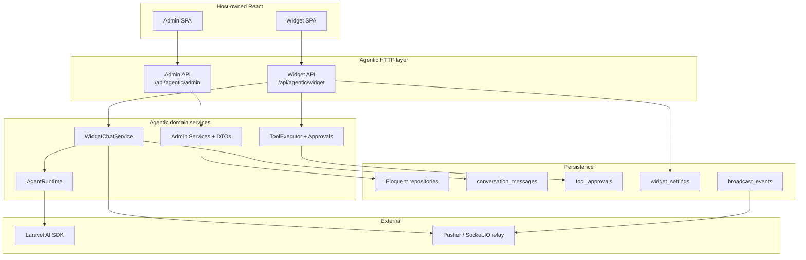
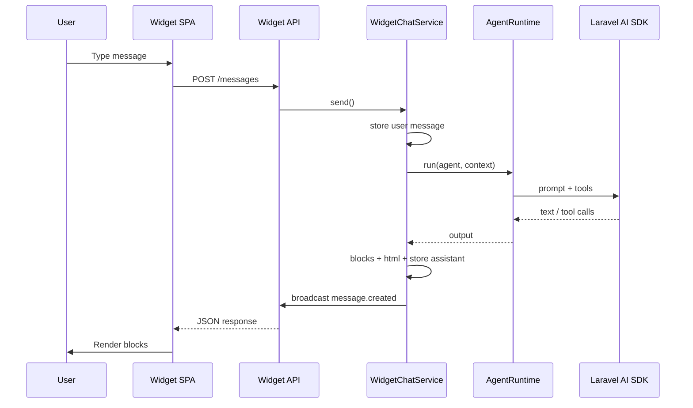
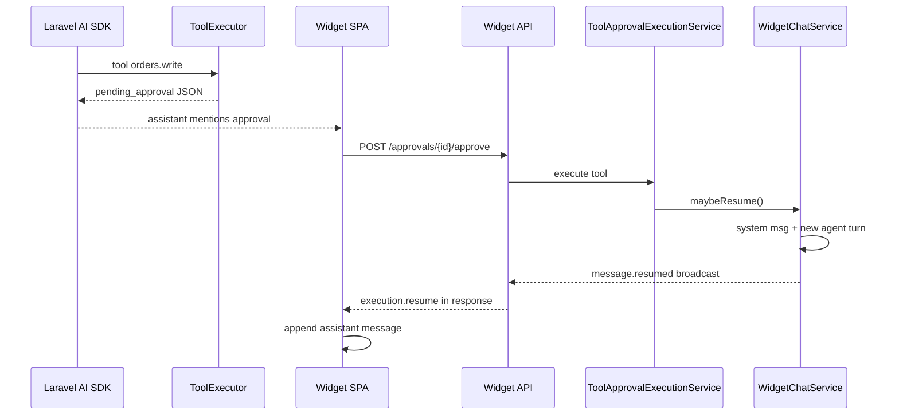

# Agentic — system design (frontend-facing)

**Last updated:** 2026-09-27

## Architecture

## Chat message flow

## Tool approval + auto-resume

## Configuration layers (widget)

Priority for per-agent widget behavior:

1. **Database** — `agentic_widget_settings.settings` (via Admin API)
2. **Config file** — `config/agentic.php` → `widget.agents.{slug}`
3. **Env / defaults** — `AGENTIC_WIDGET_*`

Public effective config is always returned by `GET /api/agentic/widget/config?agent=`.

## Realtime fan-out

| Backend driver | Storage / transport | Frontend subscription |
|----------------|---------------------|------------------------|
| `pusher` | Pusher HTTP API | `pusher-js` channel `prefix.conversationId` |
| `polling` | `agentic_broadcast_events` rows | HTTP long-poll `/realtime` |
| `socketio` | HTTP POST to host relay | Host Socket.IO client |
| `null` | none | HTTP only |

Event names are **identical** across drivers (see FRONTEND_IMPLEMENTATION_GUIDE §6).

## Security notes for UI builders

- Sanitize `html` blocks; prefer structured blocks when possible.
- Never expose Pusher secret or Socket.IO server tokens in the widget bundle — only public keys from `/config`.
- Implement host-app authentication before admin routes in production.
- Guest ids are identifiers, not secrets — still rate-limit widget endpoints at the gateway.

## Admin vs widget responsibility split

| Concern | Admin SPA | Widget SPA |
|---------|-----------|--------------|
| Agent CRUD | Yes | No |
| Widget theme/intake | Yes (DB settings) | Consume `/config` |
| End-user chat | Optional test execute | Yes |
| Tool approval UX | Optional monitoring | Yes (primary) |
| Translations | `GET /translations` | Config locale + host i18n |
