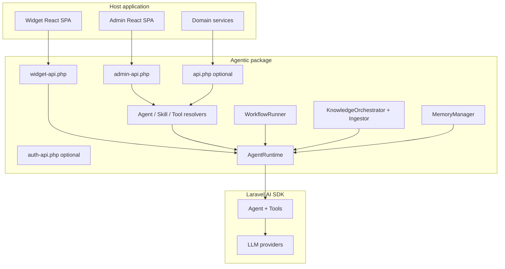
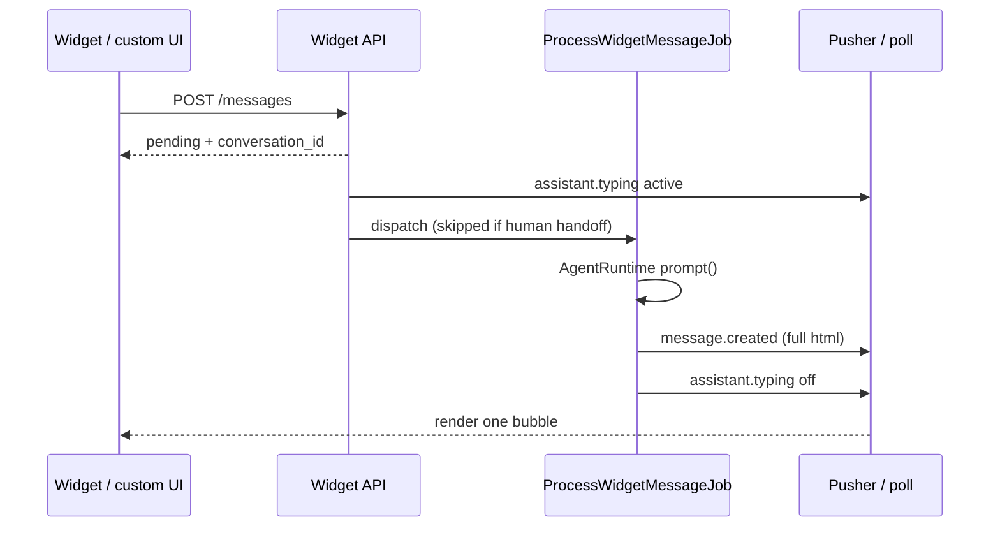

# Agentic system design

High-level architecture for the Laravel package. For route-level detail see [IMPLEMENTATION_STATUS.md](./IMPLEMENTATION_STATUS.md) and [FRONTEND_IMPLEMENTATION_GUIDE.md](./FRONTEND_IMPLEMENTATION_GUIDE.md).

## Design rules

1. **Agentic orchestrates; Laravel AI SDK executes** model calls and native tool/deferred-loading primitives.
2. **Permissions run before ToolDriver** — denied tools never hit HTTP/Code/MCP drivers.
3. **Published tool versions are immutable** — executions pin `tool_version_id`.
4. **Runtime does not query Eloquent directly** — repositories + resolvers only.
5. **Headless JSON** — production UI lives in the host app (React admin + widget).

## Widget reply path (no token streaming)

Default: `AGENTIC_WIDGET_STREAM=false`. The SDK uses `prompt()`, not `stream()`. The client renders **once** on `message.created`.

Opt-in `AGENTIC_WIDGET_STREAM=true` adds `message.delta` during the job. Official embed ignores deltas. After handoff, the job no-ops. Staff replies still publish `message.created`. See [DEVELOPER_HANDBOOK.md](./DEVELOPER_HANDBOOK.md) § Widget replies and [FRONTEND_IMPLEMENTATION_GUIDE.md](./FRONTEND_IMPLEMENTATION_GUIDE.md) §6.
